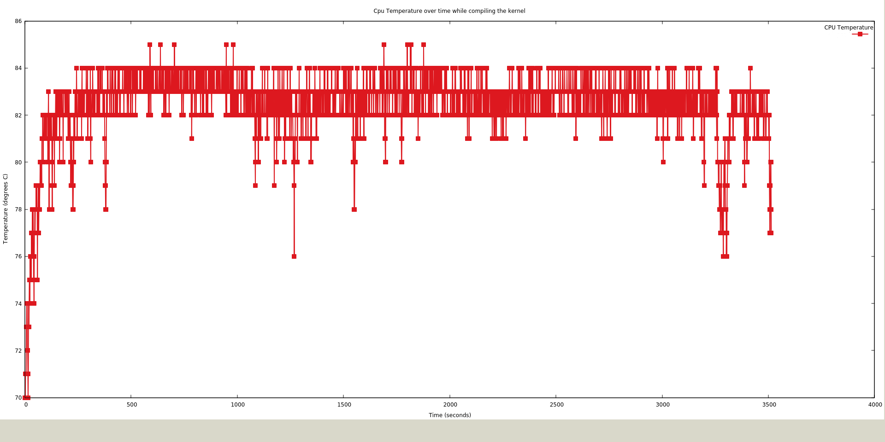

### Performance analysis of my Raspberry Pi 4 during the compilation of the kernel

From the graph, we can see the compilation process took just under an hour, which is a significant improvement over the last Pi models.

My model in specific, for most of the time, was on the edge of the CPU temperature limit, which is 85 degrees Celsius. From the graph, we can see for the first minute of the process, the CPU was in the 70s degree range, but it started to heat up quite quickly after that, to the 80s range. This happened because we specified the compiling program to use all 4 threads of the CPU, which increased the CPU workload to the maximum, hence the rapid rise in temperature. For safety reasons, as the CPU temperature hits the limit, it will automatically throttle to keep the temperature in range, or in other words, the CPU will lower its clock speed accordingly. There were only 9 instances where the CPU temp reached 85 degrees C, which showed the system did a wonderful job at keeping the CPU temperature in its operating range. 

To have a better idea of how CPU throttling works, here is the chart of CPU clock over time while compiling the kernel. As you can see, the graph here looks very dense. It's because the CPU is constantly adjusting its clock speed, from between 1000 to 1500 MHz, to make sure the CPU temperature doesn't exceed the limit. The more the CPU throttles, the worse the performance is gonna be, because the CPU doesn't run at its full speed as frequently, which in terms increases the time to compile the kernel. In short, high CPU temp -> more CPU throttle -> less performance and vice versa.

So in conclusion, to ensure you extract the most out of your processor, you need to make sure your Pi has proper cooling, like adding a heatsink, installing a fan, etc...
